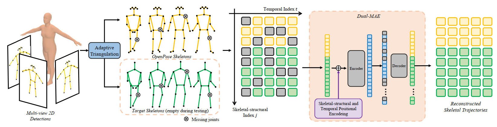

# A Dual-Masked Auto-Encoder for Robust Motion Capture with Spatial-Temporal Skeletal Token Completion

<p align="center"></p>

This repository includes the source code for our ACM Multimedia 2022 paper on multi-view multi-person 3D pose estimation. The preprint version is available at arXiv ([arXiv:2207.07381](https://arxiv.org/abs/2207.07381)). The project webpage is provided [here](https://jjkislele.github.io/pages/projects/dmaeMocap). The dataset presented in the paper is provided [here](https://jjkislele.github.io/pages/projects/hkbuMocap). Please refer to this for more details.

### Dependencies

The code is tested on Windows with

```
pytorch                   1.10.2
torchvision               0.11.3
CUDA                      11.3.1
```

We suggest using the virtual environment and an easy-to-use package/environment manager such as conda to maintain the project.

```
conda create -n dmaeMocap python=3.6
conda activate dmaeMocap
# install pytorch
conda install pytorch torchvision torchaudio cudatoolkit=11.3 -c pytorch
# install the rest of the dependencies
pip install -r requirements.txt
```

### Data preparation

Follow the instruction to prepare the necessary data:

- __Shelf__: Download the bundle from [here](https://drive.google.com/file/d/1jCjdlTEOQ1gc0En6DP5thfeIl1644YlL/view?usp=sharing) and unzip it to ``/data/shelf``.
  - The bundle consists of the pretrained model, multi-view RGB images, 2D pose detection results, camera matrices and 3D ground-truth. Except for the model, the rest of them are credited to [4D Associate Graph](https://github.com/zhangyux15/4d_association/tree/windows/data/shelf).
  - The RGB images are decoded by ffmpeg with low quality. If you want to get high-quality images, please refer to Shelf [webpage](https://campar.in.tum.de/Chair/MultiHumanPose).
  - The 2D pose detector is [OpenPose](https://github.com/CMU-Perceptual-Computing-Lab/openpose).
  - We arrange the data from _txt_ to _numpy_. The code can be found at [util/gizmo/shelf_makeup.py](util/gizmo/shelf_makeup.py).

Or, generate 2D poses on your own. We provide the instruction at [util/gizmo/data_makeup](util/gizmo/data_makeup.md).

Data should be organized as follows:

```
ROOT/
    └── data/
        └── shelf/
            └── sequences/
                └── img_0/
                └── .../
                └── img_4/
            └── camera_params.npy
            └── checkpoint-best.pth
            └── shelf_eval_2d_detection_dict.npy
    └── ...
```

### Inference

We provide the following script to reconstruct and complete 3D skeletons from multi-view RGB video sequences.

```
python inference.py
```

The configuration of triangulation can be found and modified at [util/config.py](util/config.py). It can visualize the reconstruction results when ``self.snapshot_flag = True`` at Line 18. We set ``self.snapshot_flag = False`` as default.

You can use ``python inference.py --no-dmae`` to disable the motion completion from D-MAE, and use ``--snapshot`` to enable the snapshot.

### Evaluate

```
python evaluate.py
```

Similar to ``Inference``, the way to reconstruct and complete, the evaluation script is configured by [util/config.py](util/config.py). In default, we visualize the inference results and the ground-truth at ``data/shelf/output/eval_snapshot`` directory. You can find the metrics in the command console as the output and also are saved at ``data/shelf/output/eval.log``.
If you want to evaluate the framework without D-MAE, you need to add ``--no-dmae`` to the end of the command line, i.e. ``python evaluate.py --no-dmae``.

Overall, output data would be organized as follows:

```
ROOT/
    └── data/
        └── shelf/
            └── output/
                └── eval_snapshot/
                └── npy/
                └── eval.log
            └── ...
    └── ...
```

<!-- ### Test on your dataset -->
<!-- TBD -->

### Train the D-MAE

In this short guide, we focus on HPE reconstruction and completion by the pretrained model. If you want to reproduce the results of the pretrained model, please refer to [training/README.md](training/README.md).

## Bibtex

If you use our code/models in your research, please cite our paper:

```
@inproceedings{jiang2022dmae,
  title={A Dual-Masked Auto-Encoder for Robust Motion Capture with Spatial-Temporal Skeletal Token Completion},
  author={Jiang, Junkun and Chen, Jie and Guo, Yike},
  booktitle={Proceedings of the 30th ACM international conference on Multimedia},
  year={2022}
}
```

## Acknowledgement

Many thanks to the following open-source repositories for the help to develop D-MAE.

- The reimplementation of [ViT](https://github.com/google-research/vision_transformer) and [MAE](https://arxiv.org/abs/2111.06377) from [vit-pytorch/vit_pytorch/mae](https://github.com/lucidrains/vit-pytorch/blob/main/vit_pytorch/mae.py) and [pengzhiliang/MAE-pytorch](https://github.com/pengzhiliang/MAE-pytorch)
- The reimplementation of [Fourier Embedding](https://github.com/tancik/fourier-feature-networks) from [facebookresearch/3detr](https://github.com/facebookresearch/3detr/blob/main/models/position_embedding.py)
- The fast and robust 2D HPE [OpenPose](https://github.com/CMU-Perceptual-Computing-Lab/openpose)
- The multi-view multi-person 3D HPE systems
  - [4D Association Graph](https://github.com/zhangyux15/4d_association), C++ and highly efficient
  - [MVPose](https://github.com/zju3dv/mvpose), python and easy to deploy
